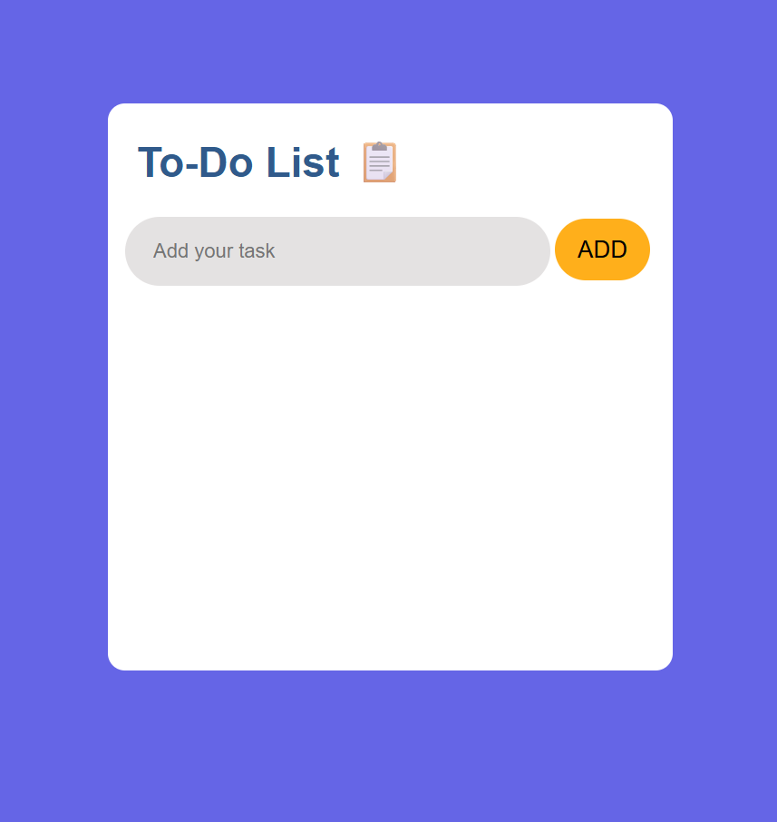
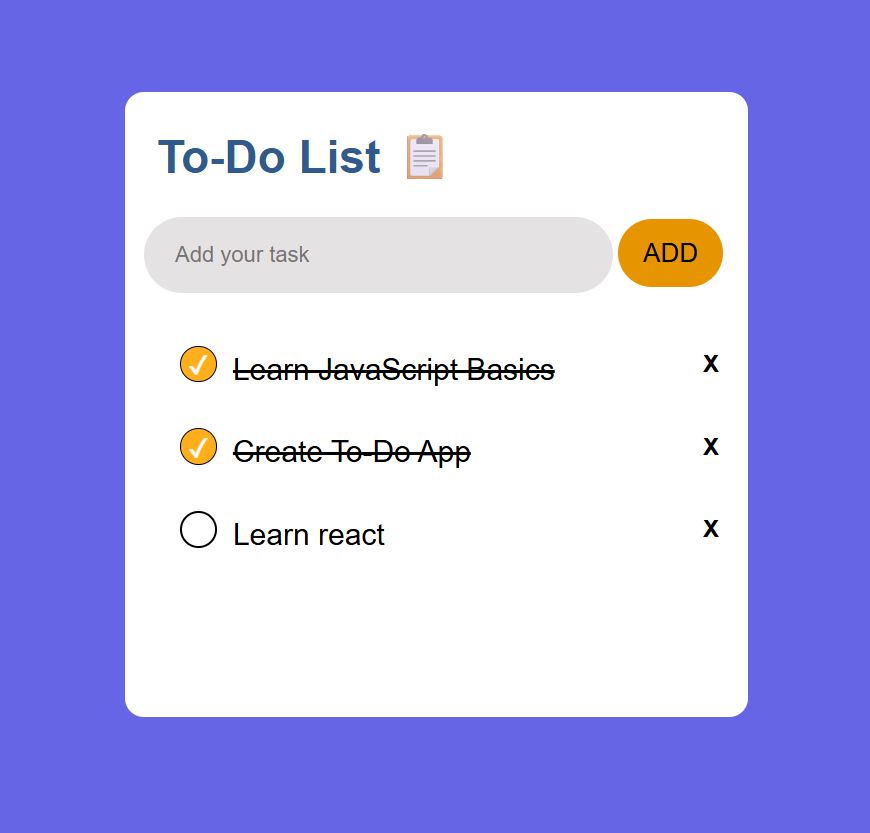

# 📝 To-Do App

A simple and responsive To-Do application built using **HTML**, **CSS**, and **Vanilla JavaScript**.

The app allows users to create, manage, and track tasks with persistent storage using the browser's Local Storage.


---

## 🌐 Live Demo

🚀 **Live:** https://todo-app-js-orcin.vercel.app/

📂 **Source Code:** https://github.com/gixxing/todo-app-js

---

## 🚀 Features

- ➕ Add new tasks
- ✅ Mark tasks as completed
- 🗑️ Delete tasks
- 💾 Automatic Local Storage persistence
- ⌨️ Press **Enter** to add a task
- ✂️ Prevent empty tasks from being added
- 🔄 Automatically restores tasks after page refresh

---

## 🛠️ Technologies Used

- HTML5
- CSS3
- JavaScript (ES6)

---

## 📸 Screenshots

### Empty State



### Tasks Added



---

## 💡 Concepts Practiced

- DOM Manipulation
- Event Handling
- Dynamic Element Creation
- Arrays of Objects
- Local Storage
- Rendering UI from Application State
- JavaScript Functions
- Conditional Rendering

---

## ▶️ How to Run

1. Clone the repository

```bash
git clone https://github.com/gixxing/todo-app-js
```

2. Open the project folder.

3. Open `index.html` in your browser.

No additional setup or dependencies are required.

---

## 📈 Future Improvements

- Edit existing tasks
- Task categories
- Due dates
- Drag and drop task ordering
- Search and filter tasks
- Dark/Light mode

---

## 👨‍💻 Author

Pranav Dubey
